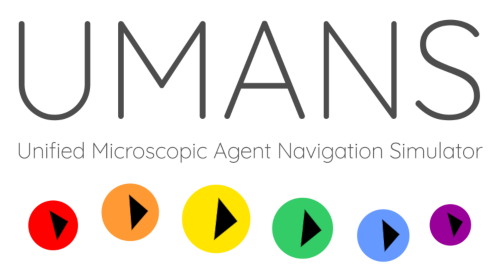

UMANS (Unified Microscopic Agent Navigation Simulator)
=======================================================

[UMANS](https://project.inria.fr/crowdscience/project/ocsr/umans/) (short for Unified Microscopic Agent Navigation Simulator) is an easy-to-use crowd-simulation engine that models each person in the crowd as an intelligent agent (i.e., the simulation is "microscopic"). UMANS currently focuses on the *local* aspects of navigation.

Many algorithms for microscopic crowd simulation have been developed over the past decades. However, each implementation has its own settings and details that can greatly influence the results. The purpose of UMANS is to reproduce as many existing algorithms as possible via one principle, while unifying as many overall settings as possible. This allows for a more honest and meaningful comparison of simulation algorithms.

UMANS was previously known as OCSR (Open Crowd Simulation Resources). Some parts of the project may still use this old name. Since 2020, the term "[OCSR](https://project.inria.fr/crowdscience/project/ocsr/)" refers to the collective of open crowd-simulation resources developed at Inria Rennes. These resources include UMANS (a simulation engine) and [ChAOS](https://project.inria.fr/crowdscience/project/ocsr/chaos/) (a visualization application).

UMANS is primarily meant for the scientific community, as a unified tool for experimenting with different navigation algorithms. However, the tool can be used freely by everyone, and it does not require any programming knowledge.

### What can UMANS do?

*  **Run a crowd simulation:** Given a scenario file containing agents and their properties, UMANS can output the trajectories of all agents during a period of time. These trajectories can then be loaded into other applications for visualization or analysis. 
* **Basic visualization:** You can use the *UMANS-GUI* application for a simple 2D visualization of a scenario.
* **Model many kinds of behavior:** A scenario file should define the so-called *policies* that agents use for local navigation. 
Overall, a policy consists of a cost function (possibly with parameters) and an optimization method. 
You can mix and match these elements as you wish. No programming knowledge is required for this.
* **Support new behavior:** If you are a programmer, you can clone the UMANS repository and *add your own cost functions* (and/or optimization methods), to add new types of behavior to the system. Adding new cost functions is easy thanks to the software's architecture.

### What can UMANS *not* do?

* **Global path planning:** The UMANS library deliberately focuses on *local navigation only*, i.e. the local interactions between agents. 
The simulation environment may contain static obstacles, but the agents in UMANS *do not* plan a global path.
* **Fancy visualization:** UMANS focuses on the simulation itself. For nice 3D animations of a crowd, consider using separate programs such as [ChAOS](https://project.inria.fr/crowdscience/project/ocsr/chaos/).

# Reference

The UMANS software has been described in the following scientific publication: 

> Wouter van Toll, Fabien Grzeskowiak, Axel López, Javad Amirian, Florian Berton, 
> Julien Bruneau, Beatriz Cabrero Daniel, Alberto Jovane, Julien Pettré.
>
> [*"Generalized Microscopic Crowd Simulation using Costs in Velocity Space"*](https://project.inria.fr/crowdscience/generalized-microscopic-crowd-simulation-using-costs-in-velocity-space-i3d-2020/). 
>
> In ACM SIGGRAPH Symposium on Interactive 3D Graphics and Games, 2020.

Please cite this publication when referring to UMANS in your work.

# Wiki and documentation

The UMANS repository comes with a [Wiki](https://gitlab.inria.fr/OCSR/UMANS/-/wikis/) that helps you install and use the UMANS software. It contains the following pages:

* [Getting started](https://gitlab.inria.fr/OCSR/UMANS/-/wikis/Getting%20started) - This page explains how to download or compile the UMANS binaries, what their main input and output is, and what to do if you run into problems.
* [Configuration files](https://gitlab.inria.fr/OCSR/UMANS/-/wikis/Configuration%20files) - This page explains the XML files that UMANS takes as input. It describes all options for these input files, so that you can create new scenarios yourself.
* [For developers](https://gitlab.inria.fr/OCSR/UMANS/-/wikis/For%20developers) - This page is for those who want to dive into the C++ code itself. For example, it explains how you can write your own cost functions. 

Also, most of the source code of UMANS has been carefully documented in a style compatible with [Doxygen](http://www.doxygen.nl/). 
This documentation is mostly meant for developers who intend to use/extend the UMANS codebase itself. 
The Doxygen documentation also facilitates development in an IDE such as Visual Studio.
If you run the Doxygen program on the UMANS root folder, it wil generate a *html* folder with all documentation pages. 
(This folder is not part of the repository on purpose.)

# Third-party code / licenses

UMANS relies on the following third-party code:

### Qt
- Website: https://www.qt.io/
- License: Open Source (https://doc.qt.io/Qt-5/opensourcelicense.html)

### nanoflann (kd-trees)
- Source code: https://github.com/jlblancoc/nanoflann
- License: BSD (https://github.com/jlblancoc/nanoflann/blob/master/COPYING)

### tinyxml (XML parsing)
- Source code: https://github.com/leethomason/tinyxml2
- License: zlib (https://github.com/leethomason/tinyxml2/blob/master/LICENSE.txt)

### ORCA (one of the collision-avoidance algorithms in UMANS)
- Source code: https://github.com/snape/RVO2
- License: Apache (https://github.com/snape/RVO2/blob/master/LICENSE)
  
### earcut (Polygon triangulation)
- Source code: https://github.com/mapbox/earcut.hpp
- License: ISC (https://github.com/mapbox/earcut.hpp/blob/master/LICENSE)

# Copyright statement

UMANS: Unified Microscopic Agent Navigation Simulator

Copyright (C) 2018-2020  Inria Rennes Bretagne Atlantique - Rainbow - Julien Pettré

This program is free software: you can redistribute it and/or modify
it under the terms of the GNU General Public License as published by
the Free Software Foundation, either version 3 of the License, or
(at your option) any later version.

This program is distributed in the hope that it will be useful,
but WITHOUT ANY WARRANTY; without even the implied warranty of
MERCHANTABILITY or FITNESS FOR A PARTICULAR PURPOSE. See the
GNU General Public License for more details.

You should have received a copy of the GNU General Public License
along with this program. If not, see <https://www.gnu.org/licenses/>.

Contact: crowd_group@inria.fr

Website: https://project.inria.fr/crowdscience/

See the file AUTHORS.md for a list of all contributors.
